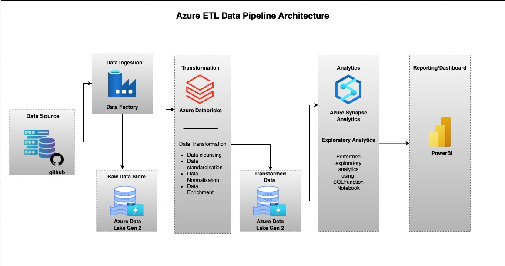

# Azure_DataEngineering_Projects


Welcome to the **Azure Data Engineering Project** repository! 🚀  
This project demonstrates the engineering component of the Microsoft Azure Platform, from data ingestion, data transformation, performing analysis and building visualisation. My experieence from this project give me insight of industry best practices in data engineering and cloud platform.

- **Project Plan:(https://sassy-koala-9ee.notion.site/Azure-ETL-Data-Engineering-Project-223d9b3994d98090bdacfbfce07e3a76?source=copy_link))**

---
## 🏗️ Data Architecture

The data etl architecture for this project mainly focus on data ingestion and transformation for easy analysis:


---
## 📖 Project Overview

This project involves:

1. **Data Architecture**: Designing a Modern Data pipeline following industry best practices using the Microsoft Azure platform.
2. **ETL Pipelines**: Extracting, transforming, and loading data from source systems into the data lake gen2.
3. **Data Modelling**: Developing fact and dimension tables optimised for analytical queries.
4. **Analytics & Reporting**: Creating SQL-based exploratory analysis reports and dashboards for actionable insights using Power BI will be added in a later iteration.

🎯 This repository is an excellent resource for showcasing my experience in:
- Microsoft Azure Cloud components for Data Ingestion and transformation
- Data Architect
- Data Engineering  
- ETL Pipeline Development using Microsoft Azure Platform
- Data Modeling  
- SQL Data Analytics
- Data Transformation
 

---

## 🛠️ Important Links & Tools:

Everything is for Free!
- **[Datasets](datasets/):** Access to the raw project dataset (csv files).
- **[Microsoft Azure Account]:** **(https://portal.azure.com/#home):** Microsoft Azure account either free trail or paid.
- **[DrawIO](https://www.drawio.com/):** Design data architecture, models, flows, and diagrams.
- **[Notion](https://www.notion.com/):** All-in-one tool for project management and organization.

---

## 🚀 Project Requirements

### Building the Azure data engineering workflow for data ingestion and transformation

#### Objective
Build an ETL pipeline using the Microsoft cloud platform to facilitate data ingestion, data transformation and data analytics.

#### Specifications
- **Data Sources**: load data from my GitHub account to Azure Lake Gen2 using the HTTP access in Azure Data Factory.
- **Data Quality and Transformation**: Transform data using Azure Databricks.
- **Integration**: Combine information from different tables to form a robust star schema data model.
- **Documentation**: Provide clear documentation of the data model in the [Data Catalog](docs/data_catalog.md).

---


## 📂 Repository Structure
```
azure_dataengineering_projects/
│
├── data_bricks_data_transformation/
├── dataset/                          # Raw datasets used for the project (Olympic 2021)
│
├── docs/                               # Project documentation and architecture details
│   ├── Azure_ETL_Data_Pipeline.jpeg # Azure ETL data architecture diagram
│   ├── data_catalog.md             # Catalog of datasets, including field descriptions and metadata
│   ├── data_flow.jpeg               # This file is for the data flow diagram
│   ├── star_schema.jpeg            # This file is for data models (star schema)
│   ├── synapse_analytics           # Perform exploratory data analysis using SQL notebook
│
│
│
├── README.md                           # Project overview and instructions
├── LICENSE                             # License information for the repository

```
---


## 🛡️ License

This project is licensed under the [MIT License](LICENSE). You are free to use, modify, and share this project with proper attribution.

## 🌟 About Me

Hello! My name is **Dean Lawrence Williams**. I recently graduated with a Master's degree in Information Systems from Uppsala University and a Bachelor's degree in Information Technology from Maulana Abul Kalam Azad University of Technology. I am passionate about data and enjoy transforming it into meaningful insights.
